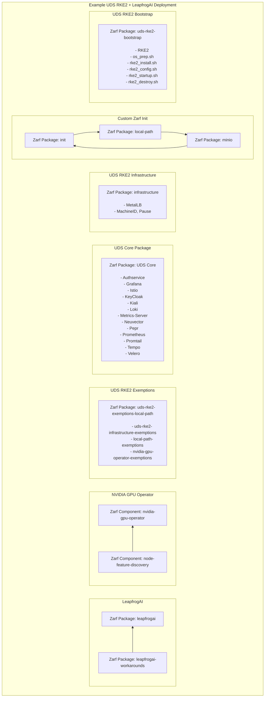

# UDS RKE2 Diagram

Below is an diagram showing an example deployment of UDS RKE2 with the `local-path` flavor custom Zarf Init, NVIDIA GPU Operator and LeapfrogAI deployed on top. The dependency chain and installation order are from bottom to top.

